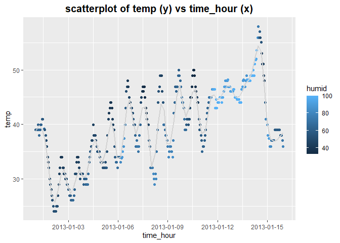

p8105_hw1_yl5508
================
Felix LIU
2023/9/23

It’s a proj for HW1 about BUILDING BLOCKS.

## Q1

### Q1.1 DATA OVERVIEW

Before we start, we need to download the dataset by
`install.packages("moderndive")`.

Use `library(moderndive)` and `data("early_january_weather")` to load
the data.

``` r
library(moderndive)
data("early_january_weather")
```

Then, we can use `names(early_january_weather)`,
`summary(early_january_weather)`, `view(early_january_weather)` and
`?early_january_weather` to see some details of the dataset.

``` r
names(early_january_weather)
```

    ##  [1] "origin"     "year"       "month"      "day"        "hour"      
    ##  [6] "temp"       "dewp"       "humid"      "wind_dir"   "wind_speed"
    ## [11] "wind_gust"  "precip"     "pressure"   "visib"      "time_hour"

``` r
summary(early_january_weather)
```

    ##     origin               year          month        day              hour      
    ##  Length:358         Min.   :2013   Min.   :1   Min.   : 1.000   Min.   : 0.00  
    ##  Class :character   1st Qu.:2013   1st Qu.:1   1st Qu.: 4.000   1st Qu.: 6.00  
    ##  Mode  :character   Median :2013   Median :1   Median : 8.000   Median :11.50  
    ##                     Mean   :2013   Mean   :1   Mean   : 8.039   Mean   :11.53  
    ##                     3rd Qu.:2013   3rd Qu.:1   3rd Qu.:12.000   3rd Qu.:17.75  
    ##                     Max.   :2013   Max.   :1   Max.   :15.000   Max.   :23.00  
    ##                                                                                
    ##       temp            dewp           humid           wind_dir    
    ##  Min.   :24.08   Min.   : 8.96   Min.   : 32.86   Min.   :  0.0  
    ##  1st Qu.:33.98   1st Qu.:19.94   1st Qu.: 51.34   1st Qu.:140.0  
    ##  Median :39.02   Median :26.06   Median : 61.67   Median :240.0  
    ##  Mean   :39.58   Mean   :28.06   Mean   : 65.48   Mean   :208.2  
    ##  3rd Qu.:44.96   3rd Qu.:35.06   3rd Qu.: 78.68   3rd Qu.:290.0  
    ##  Max.   :57.92   Max.   :53.06   Max.   :100.00   Max.   :360.0  
    ##                                                   NA's   :5      
    ##    wind_speed       wind_gust         precip            pressure   
    ##  Min.   : 0.000   Min.   :16.11   Min.   :0.000000   Min.   :1011  
    ##  1st Qu.: 5.754   1st Qu.:19.56   1st Qu.:0.000000   1st Qu.:1018  
    ##  Median : 8.055   Median :21.86   Median :0.000000   Median :1022  
    ##  Mean   : 8.226   Mean   :22.53   Mean   :0.002039   Mean   :1023  
    ##  3rd Qu.:11.508   3rd Qu.:25.32   3rd Qu.:0.000000   3rd Qu.:1027  
    ##  Max.   :24.166   Max.   :31.07   Max.   :0.190000   Max.   :1034  
    ##                   NA's   :308                        NA's   :38    
    ##      visib          time_hour                     
    ##  Min.   : 0.120   Min.   :2013-01-01 01:00:00.00  
    ##  1st Qu.: 9.000   1st Qu.:2013-01-04 19:15:00.00  
    ##  Median :10.000   Median :2013-01-08 12:30:00.00  
    ##  Mean   : 8.515   Mean   :2013-01-08 12:28:09.39  
    ##  3rd Qu.:10.000   3rd Qu.:2013-01-12 05:45:00.00  
    ##  Max.   :10.000   Max.   :2013-01-15 23:00:00.00  
    ## 

**Data Info**:  
**(a) overview:** Hourly meterological data for LGA, JFK and EWR for the
month of January 2013. This is a subset of the weather data frame from
nycflights13.  
**(b) variables:** `origin` is about the weather station,
`year, month, day, hour` is time of recording. Then, there are some
weather index variables, like `temp(temperature in F)`,
`dewp(dewpoint)`, `humid(ralative humidity)`,
`wind_dir(Wind direction in degrees)`, `wind_speed(in mph)`,
`wind_gust(gust speed in mph)`, `precip(precipitation in inches)`,
`pressure(sea level pressure in millibars)`,
`visib(visibility in miles)`,
`time_hour(Date and hour of the recording)`. Value in variables is shown
in the `summary(early_january_weather)` part.  
**(c) the size of dataset** is 358 X 15.  
**(d) the average temperature** is 39.6.

### Q1.2 SCATTERPLOT

We can get a scatter plot (temp vs time_hour) from the dataset.  
Specifically, `ggplot()` and `geom_point()` is used to depict basic
scatter plot (color in humid), `geom_smooth()` is to generate a fitted
curve of the scatter plot.  
Then, the plot is saved as “scatterplot_yl5508.png”.

``` r
ggplot(early_january_weather, aes(x = time_hour, y = temp, color = humid)) + 
  geom_point() + 
  geom_smooth(span = 0.1, se = FALSE, color = "lightgray") + 
  scale_x_datetime(date_breaks = "3 days") + 
  ggtitle("scatterplot of temp (y) vs time_hour (x)") + 
  theme(plot.title = element_text(size = 15, face = "bold", hjust = 0.5))
```

<!-- -->

``` r
ggsave("scatterplot_yl5508.png")
```

**Scatter Plot Description:**  
**(a)** Daily Temperature Fluctuations: temperatures peak around noon,
while they are low during the early morning and at night resembling a
valley-like pattern.  
**(b)** Temperature Variations Across Different Dates: As the dates
progress from early January to mid-January, the season gradually
transitions into spring, with an overall increase in temperature. This
is reflected as an upward trend in temperature over time.  
**(c)** Correlation Between Humidity level and Temperature: Overall,
humidity tends to be lower around noon, which may be related to
temperature, meaning that higher temperatures are associated with lower
humidity levels. Additionally, during periods of significant temperature
increase, humidity levels are generally higher, possibly influenced by
warm and moist air currents.

## Q2 DATAFRAME

### Q2.1 DATA COERCION

Here we generate a dataframe `q2_df` of 4 different data types. The name
of the data and vectors are `a_samp(std normal distribution)`,
`log_vector(logical vector)`, `b_vec(character vector)`,
`fac_vec(factor vector)`.

``` r
q2_df = 
  tibble(
  a_samp = rnorm(10),
  log_vec = a_samp > 0,
  b_vec = c("A", "B", "C", "D", "E", "F", "G", "H", "I", "J"),
  fac_vec = factor(c("a", "a", "a", "a", "b", "b", "b", "c", "c", "c"))
)
q2_df
```

    ## # A tibble: 10 × 4
    ##    a_samp log_vec b_vec fac_vec
    ##     <dbl> <lgl>   <chr> <fct>  
    ##  1  0.632 TRUE    A     a      
    ##  2  0.121 TRUE    B     a      
    ##  3 -1.28  FALSE   C     a      
    ##  4  0.928 TRUE    D     a      
    ##  5  1.24  TRUE    E     b      
    ##  6  1.17  TRUE    F     b      
    ##  7 -2.03  FALSE   G     b      
    ##  8 -0.250 FALSE   H     c      
    ##  9  0.634 TRUE    I     c      
    ## 10 -0.850 FALSE   J     c

The average of these four objects respectively are 0.0324206, 0.6, NA,
NA.

### Q2.2 DATA CONVERSION

Then we try to convert variables from one type to another.

``` r
as.numeric(pull(q2_df, log_vec))
as.numeric(pull(q2_df, b_vec))
as.numeric(pull(q2_df, fac_vec))
```

Only data type character cannot be convert to numeric type. As a result,
there’s no way we can use to calculate the mean of the variable.

For logical variables and factor variables, we can convert them to
numeric variables. Then, we can respectively calculate the mean of the
variables, which are 0.6 and 1.9.
